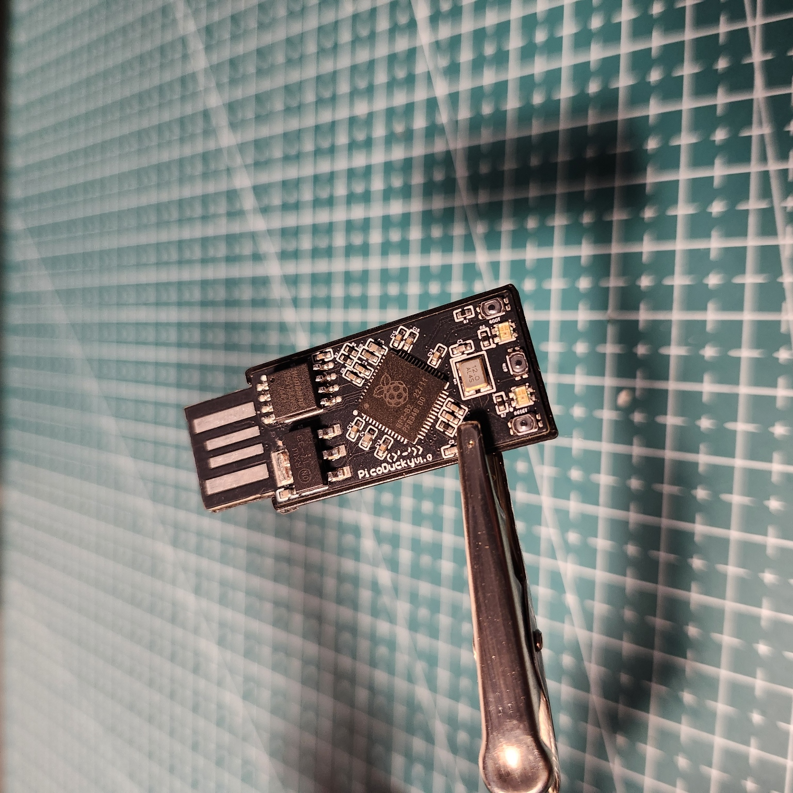
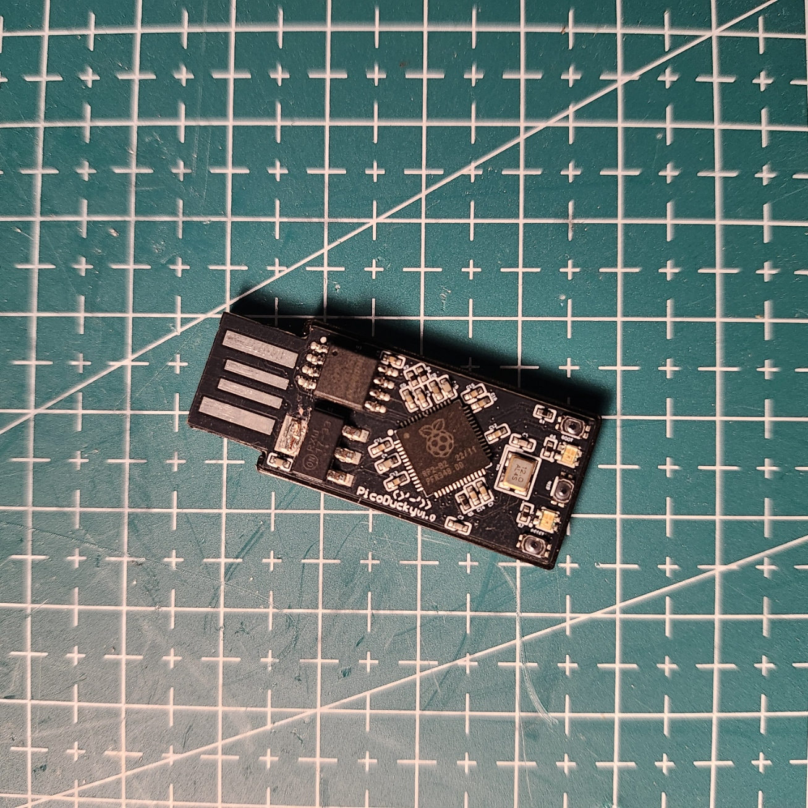
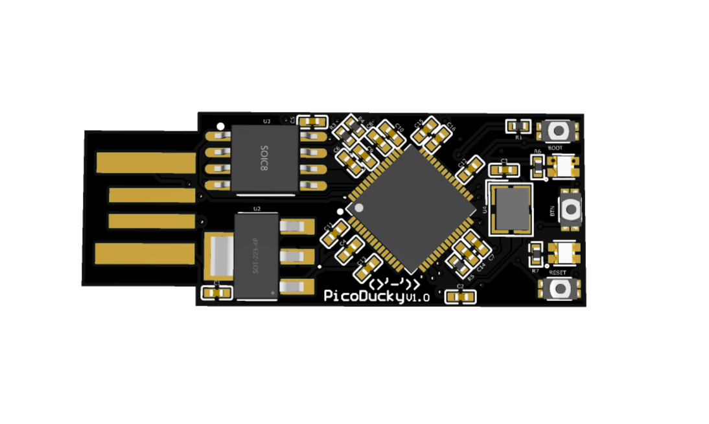
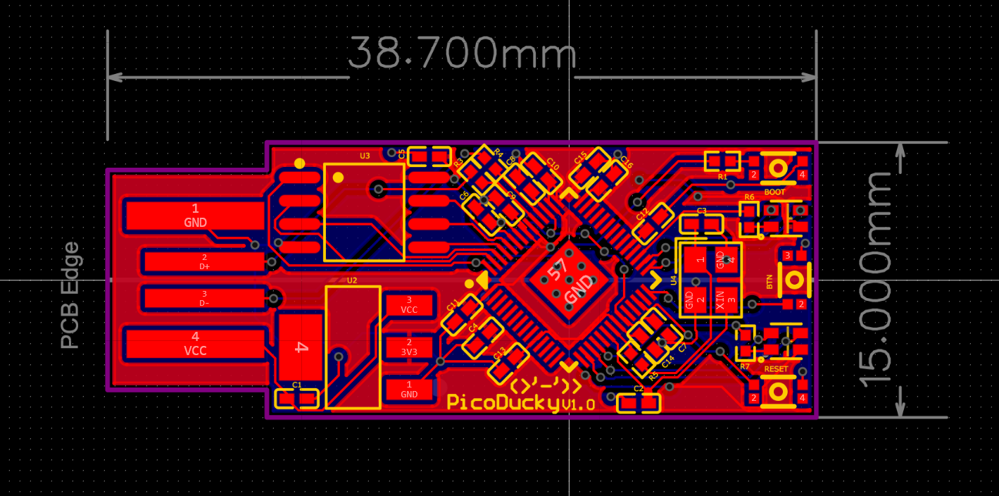
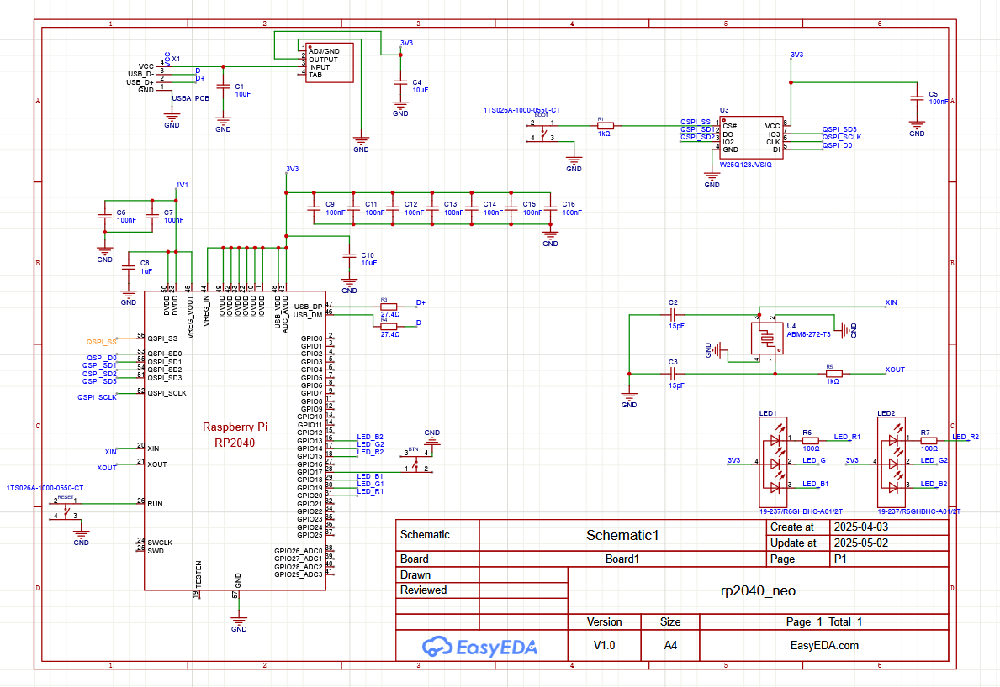

# PicoDucky V1.0
> Version 2 *might* be released soon


PicoDucky is a minimalist, USB-stick-style RP2040 development board designed to primarily act as [Rubber Ducky](https://shop.hak5.org/products/usb-rubber-ducky) styled HID device. The design was inspired by an [ATtiny85](https://www.pcboard.ca/mini-attiny85-usb) board that I owned which I really liked.


<p align="center">
  
  
</p>

## 🎥 Demo

Watch the PicoDucky in action:


## 🔧 Features

- RP2040 microcontroller (Dual-core ARM Cortex-M0+ @ 133MHz)
- Plug-and-play USB-A form factor
- Compact Size (Roughly 39x15x1.6 mm)
- 1 Programmable Button
- 2 Programmable RGB LEDs

## 📐 Schematic & PCB




## 📂 Project File Layout

```plaintext
PicoDucky/
├── LICENSE                # License file (MIT License)
├── [README.md](http://_vscodecontentref_/0)              # Project documentation
├── code/                  # Source code for firmware or scripts
├── img/                   # Images for documentation
│   ├── img.jpg            # Board front image
│   ├── img2.jpg           # Board back image
│   ├── pcb_image.png      # PCB render
│   ├── render_image.png   # 3D render of the board
│   ├── schematic_image.png # Schematic diagram
├── src/                   # Design files and production resources
│   ├── PCB.pdf            # PCB layout in PDF format
│   ├── Schematic.pdf      # Schematic in PDF format
│   ├── CAD/               # CAD files for the PCB
│   │   ├── PCB.step       # STEP file for 3D modeling
│   ├── EasyEDA/           # EasyEDA project files
│   │   ├── PicoDucky.epro # EasyEDA project file
│   ├── Production/        # Files for manufacturing
│       ├── BOM.csv        # Bill of Materials
│       ├── gerber.zip     # Gerber files for PCB fabrication
│       ├── PickAndPlace.xlsx # Pick-and-place file for assembly
```

##  🚀 Getting Started

1. Hold `BOOT` button while plugging in the board
2. Download and then drag and drop the `.uf2` from [CircuitPython](https://circuitpython.org/board/raspberry_pi_pico/)
3. Press the `RESET` button or replug the usb back into the board
4. Download adafruit circuit python bundle from [here](https://circuitpython.org/libraries)
5. Extract the bundle and find `adafruit-hid` folder inside the `lib` folder
6. Copy `adafruit-hid` folder and paste it into the CIRCUITPY `lib` folder.
7. Open `code.py` and write your own code or copy the demo code from the repo `./code/code.py`
8. All done!
