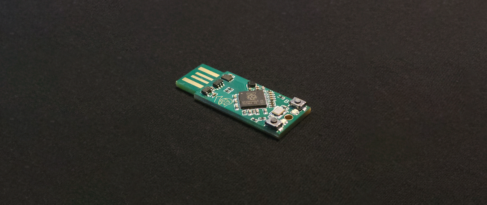
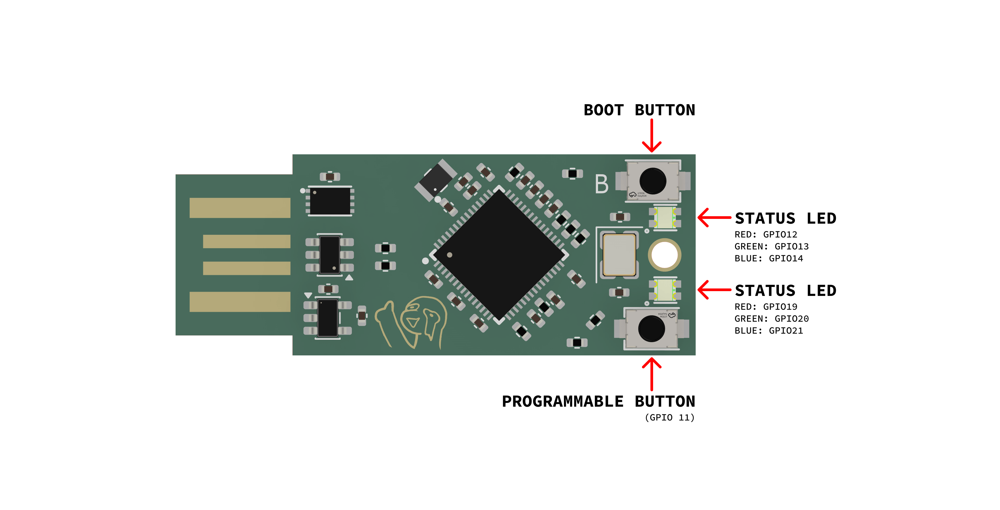
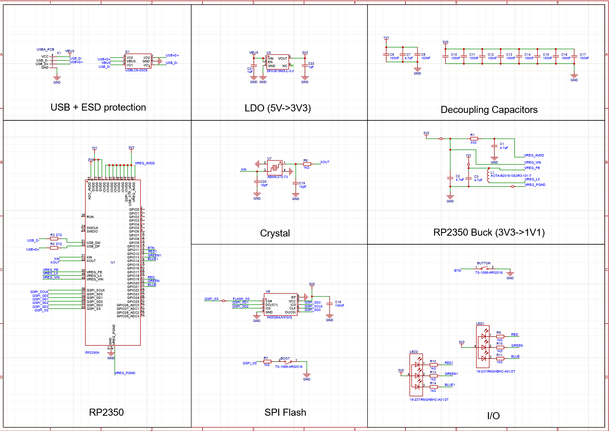
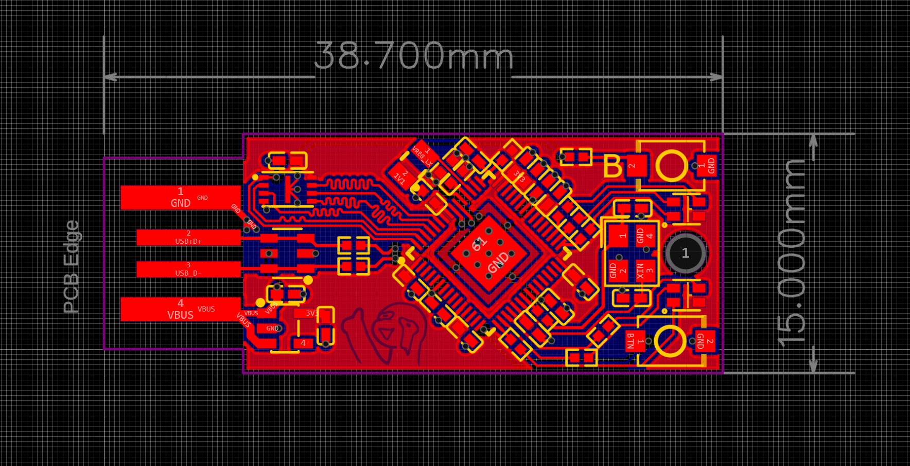

# PicoDucky V2.2

PicoDucky Version 2.2 is a minimalist, USB-stick-style RP2350 board designed for use as a security key or rubber ducky.

All source files for this board are located in `/src/V2.2`.

## Table of Contents

- [Overview](#picoducky-v2.2)
- [Quick Start](#quick-start)
- [Hardware](#hardware)
	- [Pinout](#pinout)
	- [Schematic](#schematic)
	- [PCB](#pcb)
	- [BOM/Reproduction](#bom/reproduction)
- [Firmware](#firmware)
- [Changelog](#changelog)
- [License](#license)

## Quick Start

To get started and use it as a security key
1. Hold the boot button on the board while plugging in the USB-C cable (the button has a `B` mark beside it).
2. The board will appear as a mass storage device.
3. Drag and drop the `picofido.uf2` file from `/firmware` onto the device.

The board will reboot, and the LEDs on the board should blink. It's now ready to be used as a FIDO security key.

You can head over to [webauthn.io](https://webauthn.io/) to test out your key.

## Hardware

### Pinout

### Schematic

### PCB

### BOM/Reproduction

The BOM and gerber files can be found under `/hardware/{revision}/production`

If you plan on ordering the board make sure to set your board thickness to 2.0mm to ensure it fits snugly in a USB A port. Getting ENIG finish is also recommended as it doesn't oxidize and wears less over time.

Do note that having 2.0mm and ENIG together will lead to high setup fees from your PCB fab and will be expensive. For reference getting the minimum order quantity of 5 PCBs and 2 assembled PCBs from JLCPCB with 2.0mm thickness and ENIG costs around $100.

## Firmware

This board uses [Pico Fido](https://github.com/polhenarejos/pico-fido) by [Pol Henarejos](https://github.com/polhenarejos) with slight modifications such as updating the status LED pin number for the board.

## Changelog

#### V2.2
- Switched down the external flash from 8mb to 2mb to optimize cost
#### V2.1
- Switched down to a 8mb flash for smaller footprint
- Added a 2mm hole for keychains
- Switched back to using 2 RGB LEDs
- Optimized layout and routing compared to previous versions
#### V2.0
- Switched to the RP2350
- Used smaller SOT-23-5 LDO
- Switched to using 2 bigger buttons
- 1 Green Status LED
- Added ESD protection on USB lines
#### V1.0
First ever version
- Used the RP2040
- 16mb external flash
- Chonky SOT-223 footprint LDO
- 3 tiny buttons (very hard to click)
- 2 RBG LEDs

---
## License

This project is licensed under the CERN Open Hardware Licence Version 2 Weakly Reciprocal [(CERN OHL W)](LICENSE.txt)